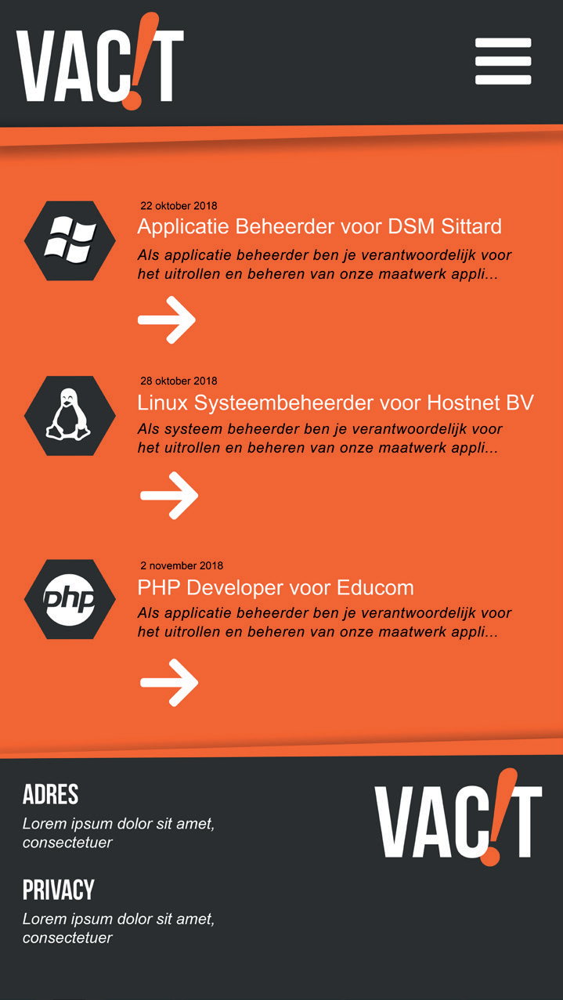

Dit is een case voor mijn opleiding, het gaat om het maken van een vacaturewebsite met gebruik van Symfony en Twig.

## Technologieën
De front-end wordt gemaakt door middel van Twig, de backend bestaat uit een PHP/Symfony systeem.

* PHP
* Symfony
* HTML
* CSS
* JavaScript
* MySQL

## Methoden & Technieken

### Entity Relation Diagram
 

## User stories:
### Werkgever:
De voornaamste taak van de werkgever is het plaatsen van vacatures. De rol die deze accounts krijgen binnen het systeem wordt ROLE_EMPLOYER. Zij hoeven niet handmatig hun accounts toe te voegen, dit kunnen zij via een Excel-spreadsheet, en zij krijgen een default password. Zij zullen alleen hun eigen geplaatste vacatures kunnen bewerken, teven kunnen zij ook hun eigen profielen aanpassen. Per vacature zullen zij de sollicitanten kunnen zien, en via deze lijst doorklikken naar de profielen. Door middel van checkboxes kunnen zij aangeven geïnteresseerd te zijn in de sollicitant.
### Sollicitant:
Deze kunnen inloggen op de site om zo te reageren op vacatures. Zij krijgen binnen het systeem de rol ROLE_CANDIDATE. Mits ingelogd kunnen zij op een vacature solliciteren, en deze sollicitatie ook weer ongedaan maken. Ook kunnen zij hun eigen profiel bijwerken. Op hun profiel komen de sollicitaties te staan waar de werkgever hun geselecteerd heeft.
### Admin:
Dit account heeft volledig beheer over alle ingevoerde gegevens.

## Ontwerp:
Er wordt gewerkt vanuit een “Mobile-First”-approach, dus een volledig responsive ontwerp, met de focus op kleine schermen. Tevens komt er een API om een lijst met vacatures op te halen, gebruikers kunnen inloggen en kunnen solliciteren.\
\
Voor het functionele design verwijs ik naar [hier](Documentatie/ASD_VacIT.graphml)
 
### Homepage
Op de homepage komt een lijst met de 5 meest recente vacatures, links komt een blok die door alle actuele vacatures met de titel, het niveau, platform-icoon, de werkgeven en de standsplaats. Er is ook een alternatieve pagina met alle actuele vacatures.\
\

### Vacature detail
Op dit scherm worden de details van de geselecteerde vacature weergegeven. Als er een Sollicitant is ingelogd, wordt de knop solliciteer direct actief, en kan via deze knop gesolliciteerd worden. Onderaan het scherm staan alle verdere vacatures voor deze Werkgever.\

### Inloggen
Hier kunnen Sollicitanten en Werkgevers inloggen, voor de Sollicitant is er een vergelijkbaar registratiescherm, deze is niet beschikbaar voor Werkgevers.\

 
### Profielpagina
Op dit scherm staan alle gegevens van de Sollicitant, deze kan zowel de profielfoto als een CV uploaden. Ook wordt er een beschrijving/motivatie gezet. Een Werkgever heeft een soortgelijke pagina om de bedrijfsgegevens in te voeren.\

 
### Sollicitaties
Hier zijn alle actieve sollicitaties van de Sollicitant te zien. Ook kan de Sollicitant hier zien op welke sollicitaties een Werkgever heeft gereageerd, er komt dan een vinkje naast de sollicitatie. De Werkgever heeft een vergelijkbaar scherm met waar per vacature de Sollicitanten te zien zijn, zij kunnen via deze pagina reageren op een sollicitatie door middel van een checkbox.\

## Stijl handboek
Er wordt gebruik gemaakt van onderstaande stijl.\

